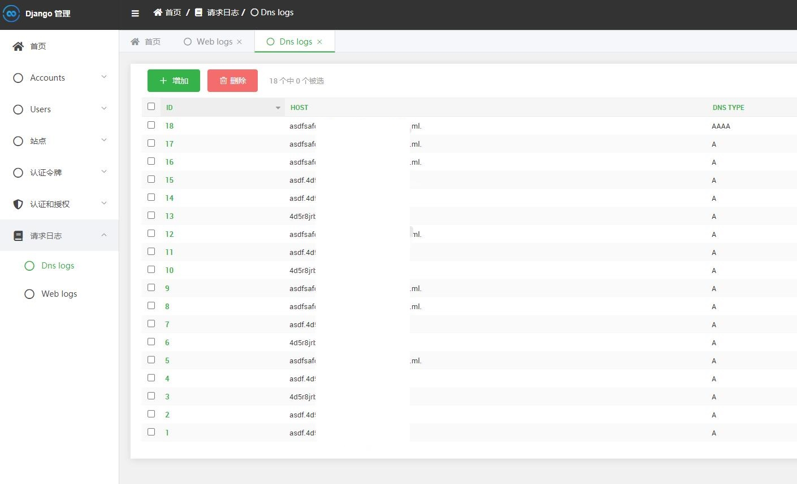
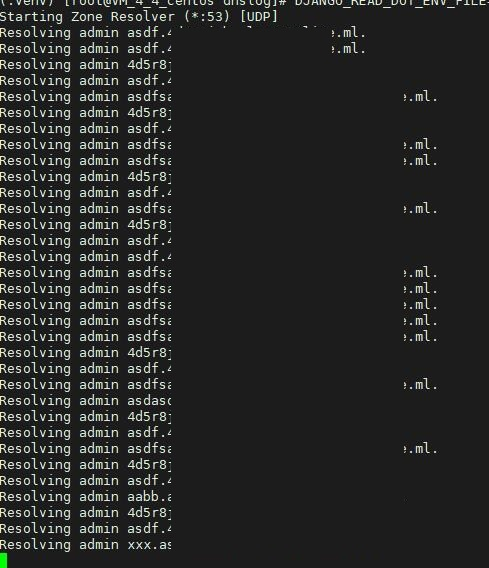
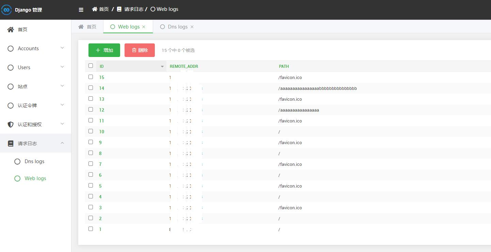
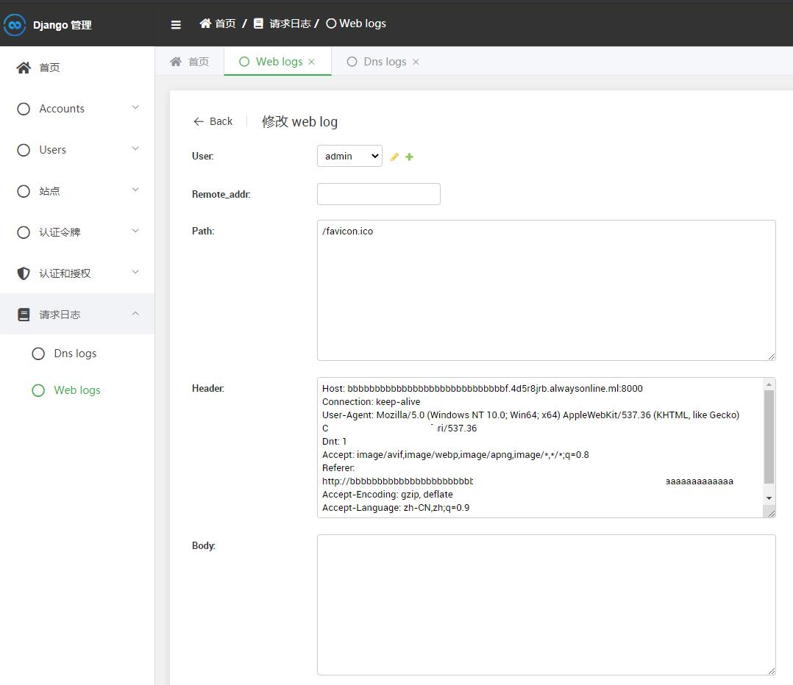

简介
---

本版本是把dnslog重构了一遍，几乎没有之前的东西了。暂时使用Django Admin作为管理数据的
UI，后续可能会使用AntDesign重构UI部分

安装
---

## 解析服务配置

类似教程很多，主要就是使用两个域名，第一个域名主要是用来提供对ns服务器IP解析之用，只需要
把ns1,ns2这两个NS规则加到域名解析服务中即可。

假设我们现在用10.10.10.10这台VPS作为部署环境，dnslog.com作为服务域名

使用域名example.com作为NS服务域名，只需要把example.com的子域名ns1,ns2解析到10.10.10.10

再到dnslog.com的域名管理后台，把dns server设置为ns1.example.com和ns2.example.com

到了这一步，解析服务的配置就完成了。

## Docker部署

暂未完成（WIP）

## 普通安装

普通安装只需要把`.env.example`文件重命名为`.env`，然后使用以下两条命令分别启动DnsServer和WebServer

```Bash
# DNS服务
DJANGO_READ_DOT_ENV_FILE=true DJANGO_SETTINGS_MODULE=config.settings.production python zoneresolver.py

# Web服务

## 正式环境
gunicorn -c gunicorn.py config.wsgi -b :8000

## 开发环境
DJANGO_READ_DOT_ENV_FILE=true python manager.py runserver_plus
```

使用效果
---

Dnslog



Server



WebLog



View weblog


